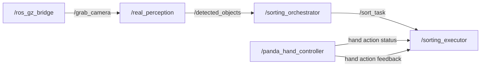

# Garb-and-Release

A ROS 2 + Gazebo + MoveIt 2 based robotic color sorting pipeline for simulation.

This project implements an end-to-end perception-to-action workflow in simulation. The robot receives camera images from Gazebo, classifies two differently colored blocks, maps them to different target locations, and executes pick-and-place motions through MoveIt 2.

---

## Project Overview

The goal of this project is to build a complete robotic sorting system in simulation rather than only a standalone classifier or a standalone motion planner. The final pipeline includes:

- camera image bridge from Gazebo to ROS 2
- color-based perception for two blocks
- task mapping from detected color to target location
- pick-and-place execution with MoveIt 2
- evaluation of full sorting success

The final system achieved:

- **Classification accuracy:** 100% (10/10)
- **Overall sorting success rate:** 70% (7/10)
- **Failure source:** 3 failures caused by inverse kinematics (IK)

---

## Demo Video

A 5-minute recorded demo video is included to show the method and the final results.


## Report

The final project report is included in this repository.

The report covers:

- project motivation
- system method
- ROS 2 node structure
- perception module
- task mapping
- motion planning and execution
- experimental results
- discussion and future work

---
## System Pipeline

The final pipeline is:

1. Gazebo publishes camera images.
2. `ros_gz_bridge` bridges the image stream into ROS 2.
3. `real_perception` detects the color of the target block.
4. `sorting_orchestrator` maps the detected color to a sorting target.
5. `sorting_executor` sends the task for manipulation.
6. MoveIt 2 executes the pick-and-place motion.

A simplified communication flow is:



---

## Main Components

### 1. Perception
The perception module subscribes to the camera image topic and identifies the color of the target block. The final setup focuses on two color classes, which keeps the visual task simple and allows the full robotic pipeline to be tested reliably.

### 2. Task Mapping
After perception, the detected color is converted into a symbolic sorting decision. Each color corresponds to a different target area.

### 3. Motion Planning and Execution
The sorting executor uses MoveIt 2 to generate and execute the pick-and-place trajectory. The motion sequence typically includes:

- pregrasp
- grasp
- lift
- transport
- place
- retreat

### 4. Simulation Environment
The complete system is tested in Gazebo with a robot manipulator and two colored blocks in a tabletop scene.

---

## Results

The final system was tested in 10 trials.

| Metric | Result |
|---|---|
| Total trials | 10 |
| Classification accuracy | 100% (10/10) |
| Successful sorting trials | 7 |
| Overall sorting success rate | 70% (7/10) |
| Failed trials due to IK failure | 3 |
| IK failure rate | 30% (3/10) |

These results show that perception was reliable in the final setup, while the main remaining bottleneck was manipulation robustness, especially inverse kinematics feasibility.

---

## Visualizations

The repository includes several images that illustrate the system:

- `images/node_list.png` — simplified ROS 2 communication structure
- `images/camera_debug.png` — perception/classification result
- `images/rviz.png` — motion planning in RViz
- `images/gazebo.png` — Gazebo simulation environment

These figures can be used both in the report and in the project presentation.

---

## How to Run

Typical workflow:

```bash
# source ROS 2
source "$ROS_DISTRO_SETUP_BASH"

# source workspace
source install/setup.bash

# launch simulation / related nodes
# run consequentially
ros2 launch sorting_bringup panda_gz_moveit.launch.py
ros2 launch sorting_bringup panda_executor.launch.py
```

Then start the main modules as needed, for example:

```bash
ros2 run sorting_perception real_perception
ros2 run sorting_orchestrator sorting_orchestrator
ros2 run sorting_executor sorting_executor
```

If the camera image is bridged from Gazebo, a bridge command such as the following may be required:

```bash
ros2 run ros_gz_bridge parameter_bridge /grab_camera@sensor_msgs/msg/Image[gz.msgs.Image
```

Update the exact launch and run commands according to your repository.

---

## Future Work

Possible future extensions include:

- improving inverse kinematics robustness
- adding more object categories
- supporting more complex scenes
- improving grasp pose generation
- replacing the simple color classifier with a stronger perception model

---


## Notes

This repository contains the project code, report, and demo materials for the ECE 176 final project.
